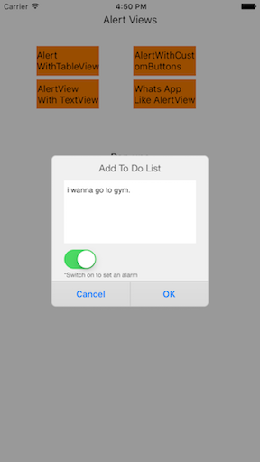

# MTGenericAlertView

### Main Features:

1. Support for any version (As this alert view is based on UIView, No deprecation).

2. We can show any type of content in alert view. Eg: Table view, Image View, Text View etc.,

3. Customizable alert Title: We can add title color, background image etc.,

4. Customizable buttons: Buttons also customizable. We can add our own customized buttons.

5. The alert will change into PopUp View in seconds. 

6. Adaptive to device orientations, screen sizes, keyboard show, dismiss.

### Installation
- Download the files or clone the project
- Drop MTGenericAlertView folder in your project

## Screenshots





###Usage

Import the MTGenericAlertView in your class
```objective-c
    import "MTGenericAlertView"
```

Add delegate to get notified through delegate methods when alertview button clicked
```objective-c
    @interface ViewController : UIViewController<MTGenericAlertViewDelegate>
```

in your .m file add these lines of code
```objective-c
    MTGenericAlertView *MTGenericAlertViewtainer = [[MTGenericAlertView alloc] initWithTitle:@"Alert!!" titleColor:nil titleFont:nil backgroundImage:nil];
    [MTGenericAlertViewtainer setCustomInputView:[self createSampleView]]; \\Add customized view to this method
    MTGenericAlertViewtainer.tag = 3;
    [MTGenericAlertViewtainer setDelegate:self];
    [MTGenericAlertViewtainer setCustomButtonTitlesArray:[NSMutableArray arrayWithObjects:@"OK",nil]];
    [MTGenericAlertViewtainer show];
```
### Delegate methods
```objective-c
- (void)alertView: (MTGenericAlertView *)alertView clickedButtonAtIndex: (NSInteger)buttonIndex
{
NSLog(@"Delegate: Button at position %d is clicked on alertView %d.", (int)buttonIndex, (int)[alertView tag]);
[alertView close];
}
```

You may use a Block, rather than a delegate.
```objective-c
    [MTGenericAlertViewtainer setAlertViewButtonActionCompletionHandler:^(MTGenericAlertView *alertView, int buttonIndex) {
    NSLog(@"Block: Button at position %d is clicked on alertView %d.", buttonIndex, (int)alertView.tag);
    [alertView close];
    }];
```
### Switch to PopUp view
To Change alertView into Popup, set Boolean value for property **isPopUpView** to **YES**
```objective-c
    MTGenericAlertViewtainer.isPopUpView = YES
```
### Requirements

- iOS 6.1 or higher
- Automatic Reference Counting (ARC)

### Author

- [Sivajee Battina](https://github.com/sivajeebattina) ([@sivajeebattina](https://facebook.com/shivajibattina))


